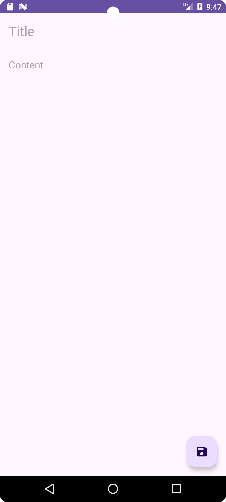
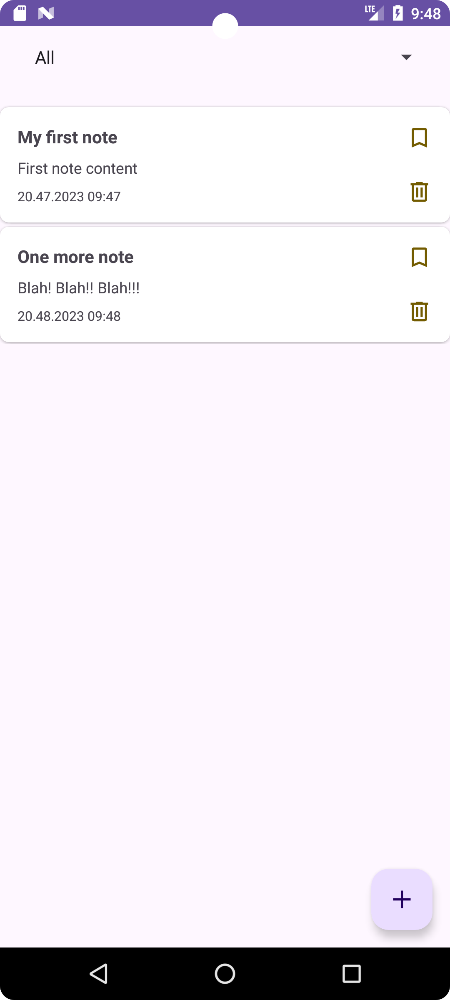
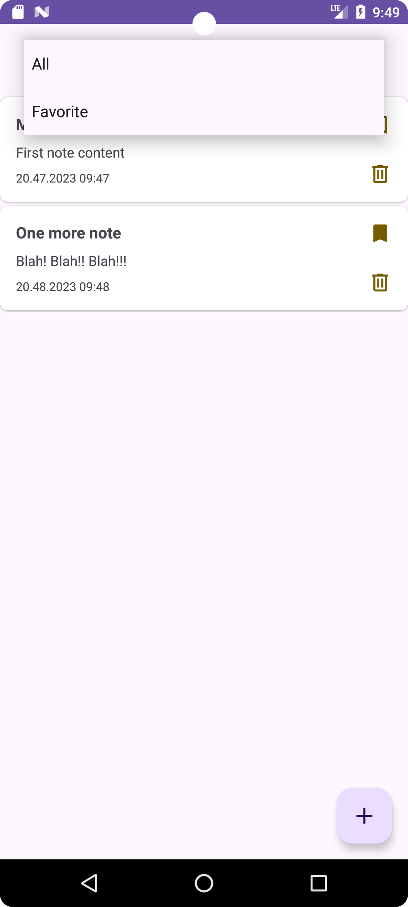

## In progress

# Notes
Notes app with favorite list.

### MVVM, Clean architecture project

#### Description

The application allows you to manage your notes.  
The following functions are available now:
  
  - add a new note;
  - see existing notes list;
  - edit an existing note;
  - delete / restore a note;
  - add a note to the favorites list;
  - see favorite notes list.

  
    
    
    
    
    
  

  
  
 
    
    
    
    

### Tech stack
- Kotlin
- Coroutines + Flow
- Clean architecture
- MVVM + UDF
- View binding
- Room
- Cicerone
- Koin

### Backlog

- [x] Add favorite notes list
- [ ] Add sorting of notes by date/title __IN PROGRESS__
- [ ] Add localization support __IN PROGRESS__
- [ ] Add night mode support __IN PROGRESS__
- [ ] Change app style
- [ ] Сover the application with tests
- [ ] Fix navigation backstak 
