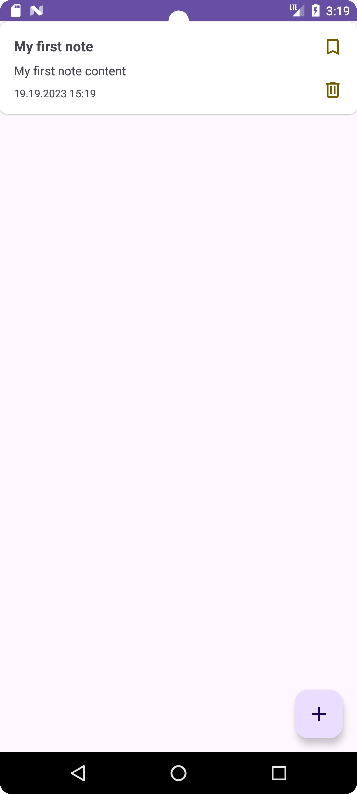
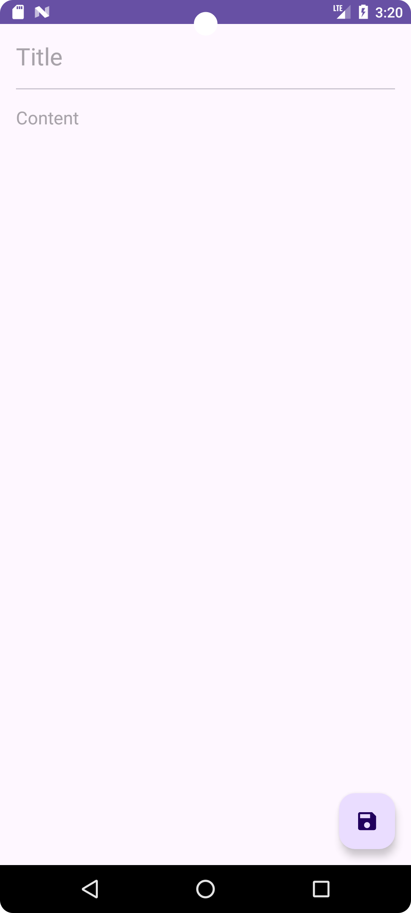
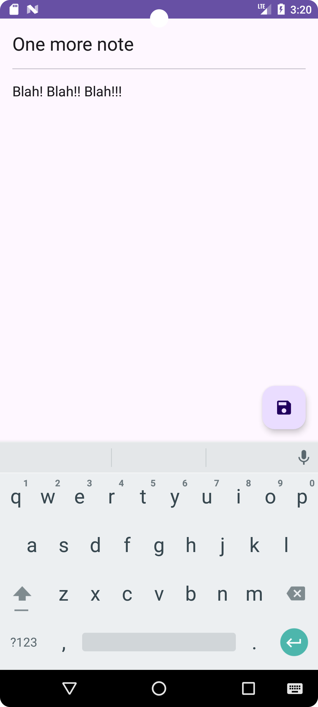
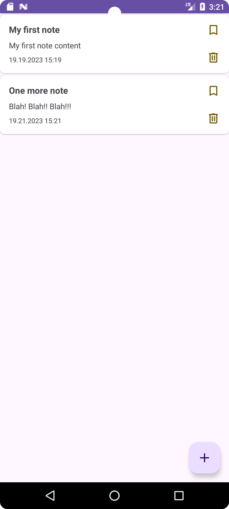
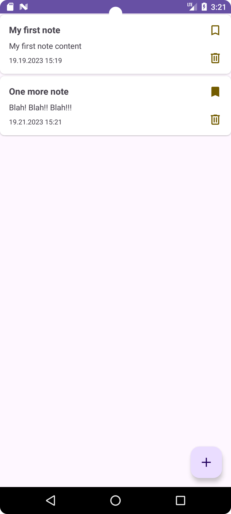
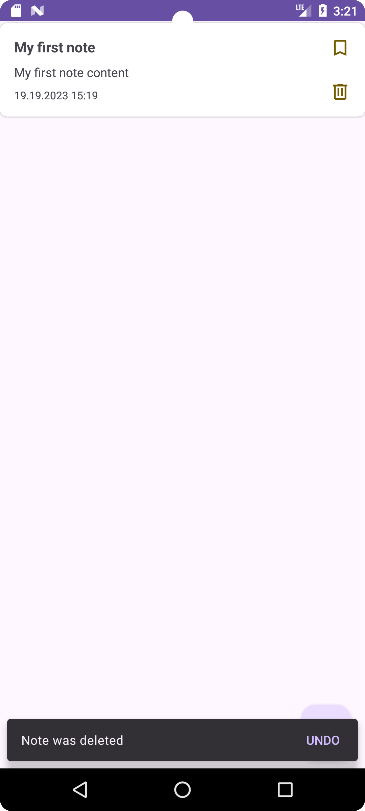

## В работе

# Notes
Приложение Заметки со списком избранных.

### MVVM, Clean architecture project

#### Описание

Приложение для управления заметками.  
В настоящий момент доступны следующие функции:
  
  - добавление новой заметки;
  - редактирование существующей заметки;
  - удаление заметки;
  - добавление заметки в списко избранного.

  
    
    
    
      
  

  
  
 
    
    
    

### Стек технологий
- Kotlin
- Coroutines + Flow
- Clean architecture
- MVVM + UDF
- View binding
- Room
- Cicerone
- Koin

### Backlog

- Добавить список избранных заметок
- Добавить сортировку по названию / дате
- Добавить поддержку русского языка
- Добавить поддержку тёмной темы
- Поменять стиль приложения
