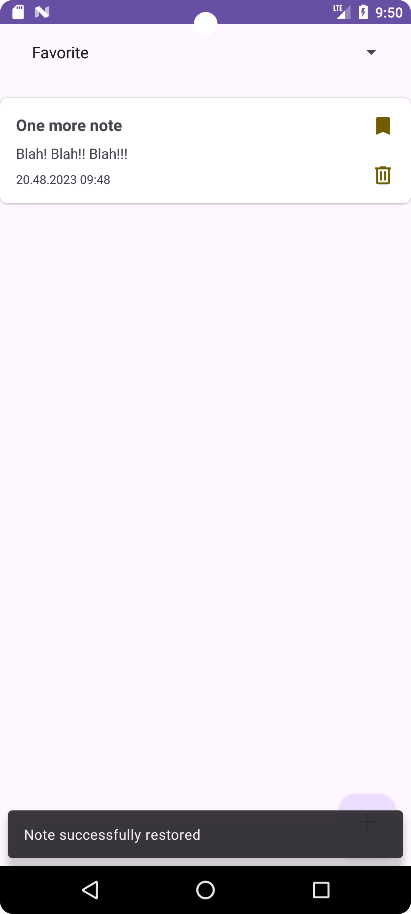

## В работе

# Notes
Приложение Заметки со списком избранных.

### MVVM, Clean architecture project

#### Описание

Приложение для управления заметками.  
В настоящий момент доступны следующие функции:
  
  - добавление новой заметки;
  - просмотр списка всех заметок;
  - редактирование существующей заметки;
  - удаление / восстановление заметки;
  - добавление заметки в списко избранного;
  - просмотр списка избранных заметок.

  
    
    
    
    
    
  

  
  
 
    
    
    
    

### Стек технологий
- Kotlin
- Coroutines + Flow
- Clean architecture
- MVVM + UDF
- View binding
- Room
- Cicerone
- Koin

### Backlog

- [x] Добавить список избранных заметок
- [x] Добавить сортировку по названию / дате
- [ ] Добавить поддержку русского языка __В РАБОТЕ__
- [ ] Добавить поддержку тёмной темы __В РАБОТЕ__
- [ ] Поменять стиль приложения
- [ ] Покрыть приложение тестами
- [ ] Пофиксить backstack навигации
